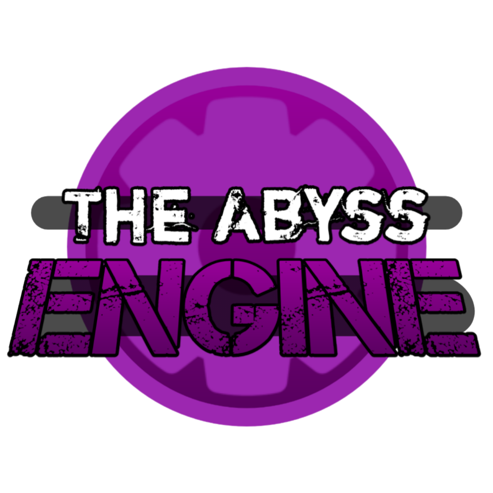
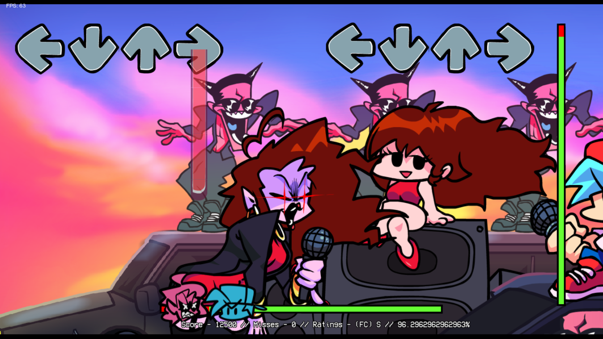
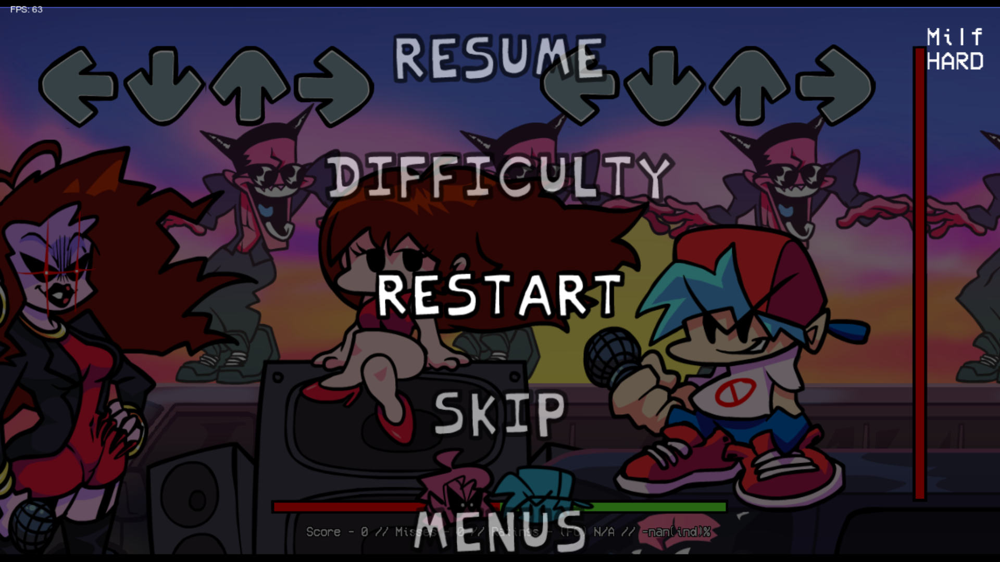
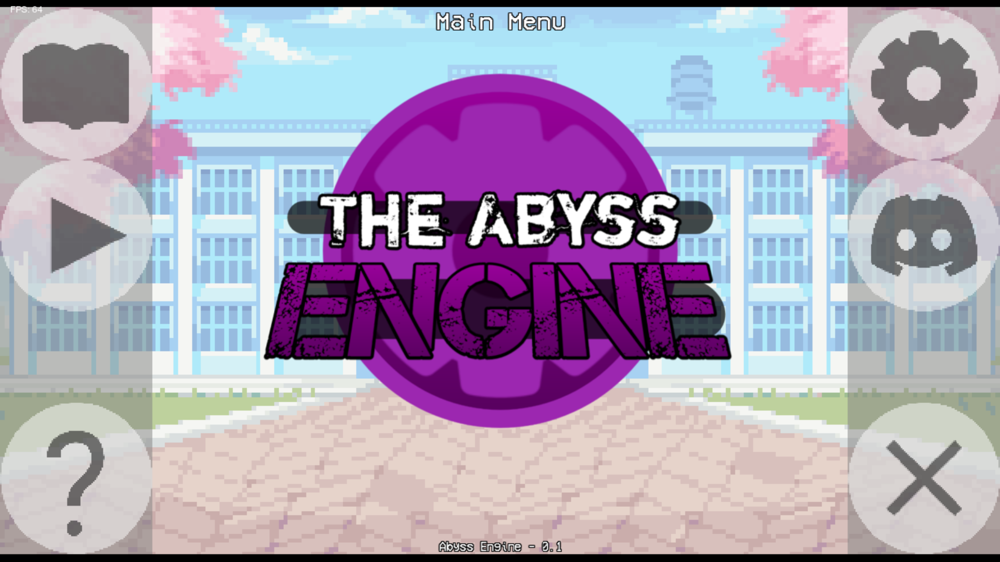
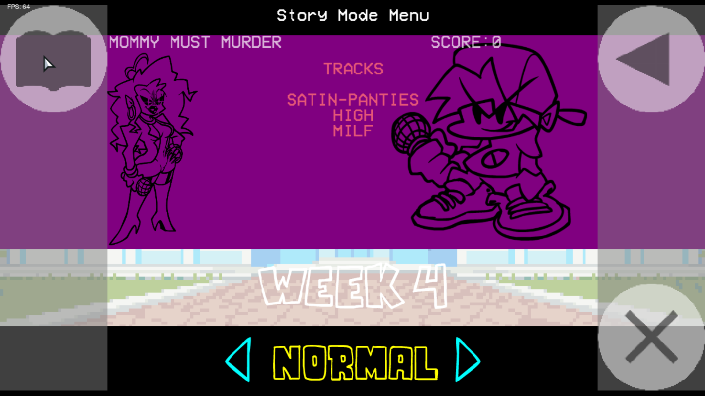
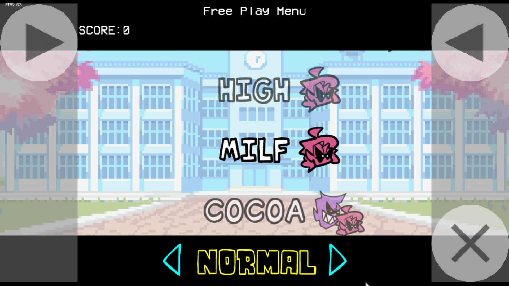
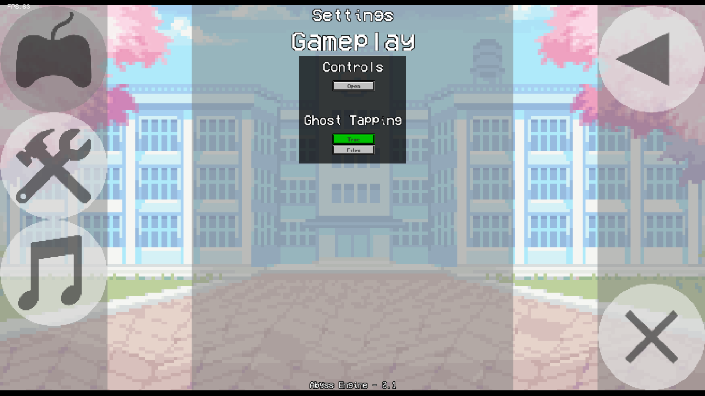
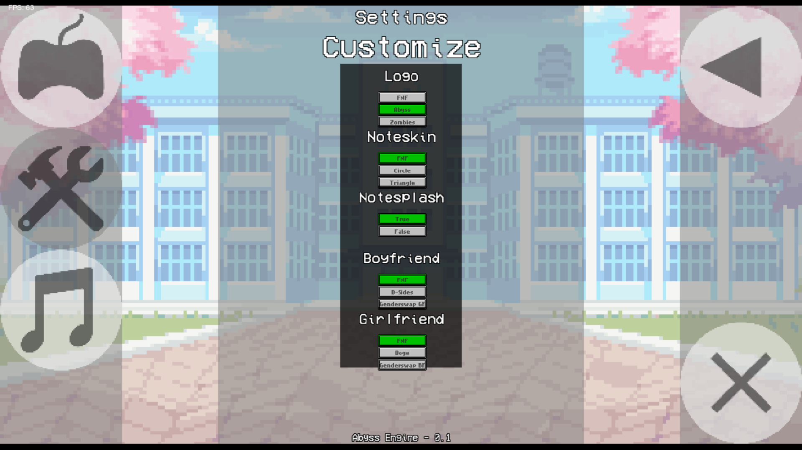
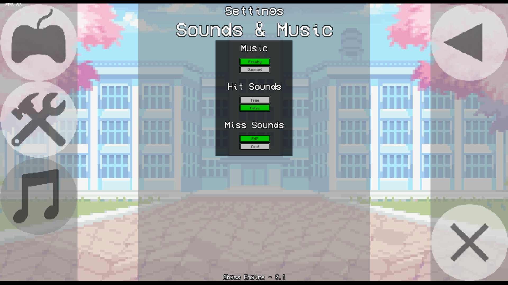

# The Abyss Engine

- The Abyss Engine is an Engine for Friday Night Funkin'.
This Engine adds completely new Simple Menus to the game, inspired by the CS:GO Panorama Menu. Most of them are Mouse-Based, meaning you have to use your mouse to navigate through the menus!
This Engine also adds over 10 Settings/Options such as: Controls, Ghost Tapping, Logo, Noteskins, Notesplash, Boyfriend, Girlfriend, Music, Hit Sounds and Miss Sounds options.

- If you thought that was it, Nope! This Engine also adds more COOL Features!
Vertical Bar AKA The Accuracy Bar.
Easier Navigation through the Pause Menu: Skip Song, Change Difficulty, Chart Editor, Animation Debug and Menus Shortcuts.

# Previews
<div>








</div>

# Why you should use this Engine
- Simple Mouse-Based Menus.
- Useful Settings/Options. (More to come in the Future!)
- Cool features. (More to come in the Future!)
In the end, it's really up to you whether you want to use it or not.
This Engine supports both PC and Android Platforms.

# Credits

### The Abyss Engine
- [Wyxos (me!)](https://twitter.com/wyxos_) - Engine Creator
- [KadeDev](https://twitter.com/kadedeveloper) - Keybinds, Inputs and Accuracy Code
- [Tr1NgleBoss](https://github.com/Tr1NgleDev) - Notesplash Code
- [Mizanploz](https://twitter.com/MizanPloz) - Genderswap GF and BF Skins
- [Vanilai](https://gamebanana.com/members/1786153) - Doge Girlfriend Skin
- [D-Sides](https://gamebanana.com/mods/305122) - Idk who made the BF Skin
- [Luckydog7](https://www.youtube.com/channel/UCeHXKGpDKo2eqYKVkqCUdaA) - Mobile Controls/Buttons Code

### Friday Night Funkin'
- [Ninjamuffin99](https://twitter.com/ninja_muffin99) - Programmer
- [PhantomArcade3K](https://twitter.com/phantomarcade3k) and [Evilsk8r](https://twitter.com/evilsk8r) - Art
- [Kawaisprite](https://twitter.com/kawaisprite) - Musician

This game was made with love to Newgrounds and its community. Extra love to Tom Fulp.

# Build instructions

The Abyss Engine doesn't use any UNKNOWN 3rd party shit, just follow these:

- [For PC](https://github.com/ninjamuffin99/Funkin/blob/master/README.md)
- [For Android](https://github.com/luckydog7/Funkin-android#readme)

Or you could read my instructions below:
## Installing the Required Programs
### PC
- 1- [Install Haxe 4.1.5](https://haxe.org/download/version/4.1.5/)
- 2- [Install HaxeFlixel](https://haxeflixel.com/documentation/install-haxeflixel/) (After installing Haxe)
- 2.5- If you're lazy just paste this into the Command Prompt:
```
haxelib install lime
haxelib install openfl
haxelib install flixel
haxelib run lime setup flixel
haxelib run lime setup
haxelib install flixel-tools
haxelib run flixel-tools setup
haxelib update flixel
```
- 3- [Install openfl 9.0.2](https://lib.haxe.org/p/openfl/9.0.2) (This fixes the problem with one track missing on the tracklist)
- 4- Install all these additional libraries, you will need them to compile the game, you can just check `Project.xml` in the project root to find these. Currently, these are all the things you need to install:
```
haxelib install flixel
haxelib install flixel-addons
haxelib install flixel-ui
haxelib install hscript
haxelib install newgrounds
```
You'll also need to install a couple things that involve Gits. To do this, you need to do a few things first.
- 5- Download [git-scm](https://git-scm.com/downloads). Works for Windows, Mac, and Linux, just select your build.
- 6- Run `haxelib git polymod https://github.com/larsiusprime/polymod.git` to install Polymod.
- 7- Run `haxelib git discord_rpc https://github.com/Aidan63/linc_discord-rpc` to install Discord RPC.
- 8- Run `haxelib git flixel-addons https://github.com/HaxeFlixel/flixel-addons` to install Flixel Addons (Fixes the transition bug in songs with zoomed-out cameras)

- 9- Open File Explorer, then open Windows Powershell by clicking on `File` on the Top Left of the screen, and then Type `lime test windows` (You must open Windows Powershell on the project root folder)
- 10- Have fun! Enjoy the Engine/Game :D

### Android
- 1- [Install JDK8](https://www.oracle.com/java/technologies/javase/javase-jdk8-downloads.html) - You need it for the lime setup.
- 1.5- [Bypassed Login JDK8 Link](https://download.oracle.com/otn-pub/java/jdk/8u301-b09/d3c52aa6bfa54d3ca74e617f18309292/jdk-8u301-windows-x64.exe) - Sometimes it will say for u to login, and this link bypasses it.
- 2- [Install NDK r20b](https://github.com/android/ndk/wiki/Unsupported-Downloads) - You need the r20b version specifically, this is the one that fixed a huge problem i was having, PCH Errors.
- 3- [Install Android Studio](https://developer.android.com/studio) - You need it for the SDK that will be used on the lime setup and etc.
- 4- Type `lime setup android` and paste all the paths to JDK, NDK and SDK. (Your paths not the ones shown below)
<div>

</div>

- 5- Open File Explorer then open Windows Powershell, by clicking on `File` on the Top Left of the screen, and then Type `lime test android` (You must open Windows Powershell on the project root folder)

# Thanks for Reading
Most importantly, have a nice day! :D